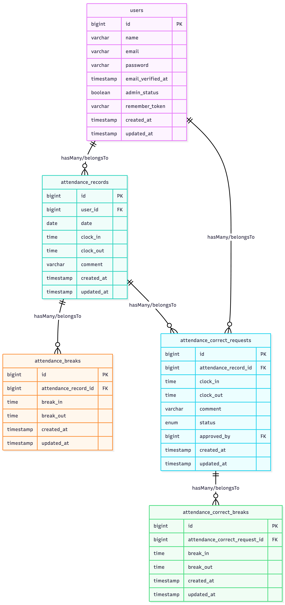

# coachtech 勤怠管理アプリ

## サービス概要

coachtech 勤怠管理アプリは、一般ユーザーの出退勤・休憩の打刻や勤怠修正申請、管理者による勤怠確認・修正・申請承認までを行える勤怠管理システムです。機能や画面をシンプルにして使いやすくしました。

## 環境構築

### Dockerビルド

- `git clone git@github.com:misawayb/coachtech-attendance.git`
- `docker-compose up -d --build`<br/>
  Macで linux/arm64 のエラーが表示されてビルドできなかった場合 docker-compose.yml に以下を追記して再度`docker-compose up -d --build`する<br/>
  エラーが出てもビルドできている場合は無視してもOK
    ```
    mysql:
        platform: linux/x86_64
        image: mysql:8.0.26

### Laravel環境構築

1. `docker-compose exec php bash`
2. `composer install`
3. `cp .env.example .env`
4. envの環境変数が以下になっていることを確認
    ```
    .env
        DB_CONNECTION=mysql
        DB_HOST=mysql
        DB_PORT=3306
        DB_DATABASE=coachtech_attendance_db
        DB_USERNAME=laravel_user
        DB_PASSWORD=laravel_pass
        MAIL_SCHEME=tls
        MAIL_HOST=sandbox.smtp.mailtrap.io
        MAIL_PORT=2525
5. Mailtrapの設定（会員登録時のメール認証で使用）<br/>
    - [Mailtrap](https://mailtrap.io)にアカウント登録・ログイン
    - Email Sandbox → My Sandbox → Integration → SMTP を開く
    - 表示されたCredentialsの値を設定する
        ```
        .env
            MAIL_USERNAME=各自のMailtrapのUsername
            MAIL_PASSWORD=各自のMailtrapのPassword
6. アプリケーションキー作成<br/>
   `php artisan key:generate`
7. マイグレーション実行<br/>
   `php artisan migrate`
8. シーディング実行<br/>
    `php artisan db:seed`

## テスト実行

`docker-compose exec php bash`でコンテナに入り、以下を実行<br/>
`php artisan test`
## 開発環境・URL一覧

### 一般ユーザー

- ログイン：http://localhost/login
- 会員登録：http://localhost/register
- 勤怠打刻画面（TOP画面）：http://localhost/attendance
- 勤怠一覧（月次）：http://localhost/attendance/list
- 申請一覧：http://localhost/stamp_correction_request/list
### 管理者
- ログイン：http://localhost/admin/login
- 勤怠一覧（日別）：http://localhost/admin/attendance/list
- スタッフ一覧：http://localhost/admin/staff/list
- 申請一覧：http://localhost/admin/stamp_correction_request/list
### phpMyAdmin
http://localhost:8080

## テストユーザー（初期シーディングデータ）

| 権限 | メールアドレス | パスワード |
| --- | --- | --- |
| 一般ユーザー | user1@example.com | password |
| 一般ユーザー | user2@example.com | password |
| 管理者 | user3@example.com | password |

## 使用技術（実行環境）

- PHP 8.4
- Laravel Framework 13.12.0
- MySQL 8.0
- Nginx 1.21.1
- Docker / Docker Compose

## ER図


